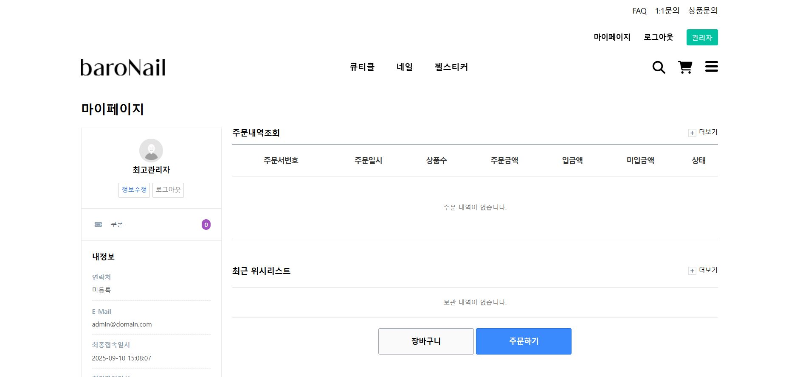

## 프로젝트 정보

# 프로젝트명

네일 쇼핑몰 (Gnuboard 기반)

## 개발 기간

2023.02 ~ 2023.05

## 개발 인원

2인 (회사 프로젝트)

## 사용 기술

- 프론트엔드: HTML, CSS, JS
- 백엔드: PHP (Gnuboard)
- DB: MySQL
- 기타: XAMPP, jQuery

---

## 사이트소개

### 메인페이지

---

##

설명: 쇼핑몰 메인페이지 입니다.

### 메뉴 페이지

설명: 상단에 위치한 큐티클 메뉴를 누르면 큐티클 관련 페이지로 이동합니다.

### 상품 페이지

설명: 상품을 클릭하면 해당하는 상품으로 이동합니다.

---

설명 : 좋아요를 누르면 하트표시에 빨간색으로 표시가 됩니다.

### 장바구니 페이지

설명 : 장바구니에 담은 상품을 보여주는 페이지입니다.

### 주문 페이지

설명 : 상품 주문에 필요한 정보를 입력하는 페이지입니다.

설명 : 주문이 완료 된 후 페이지입니다.

### 마이 페이지

설명 : 사용자의 정보를 보여주는 마이페이지입니다.

설명 : 장바구니 및 상품을 주문했을 시 사진과 같이 표시됩니다.

설명 : 주문한 상품에 상태에 따른 표시입니다.
